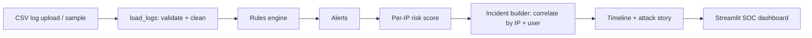

# 🛡️ Find the Intruder (ALG-CYBER-01, Algothon'26)

Upload authentication logs and get the attacker, a correlated incident timeline, per-IP risk scores and an auto-written attack story.

## Run locally
```bash
pip install -r requirements.txt
python generate_logs.py        # optional, the app creates the sample log itself
streamlit run app.py
python tests/test_detector.py  # tests
```

## Architecture


## Detection rules
| Rule | Logic | Stage |
|---|---|---|
| brute_force | >=10 failed logins from one IP in 10 min (also flags password spray) | Initial Access |
| success_after_bf | successful login from that IP afterwards | Credential Access |
| new_geo | login from a country other than the user's usual one | Anomaly |
| off_hours | 00-05h activity for a user who never works then | Anomaly |
| priv_esc | privilege_change event | Privilege Escalation |
| data_exfil | >=200 MB downloaded by one user/IP in an hour | Exfiltration |
| log_tamper | log_cleared event | Defense Evasion |

Alerts are summed per IP into a 0-100 risk score (each rule counted once). IPs scoring >=70 become an **incident**, whose alerts are ordered into a kill-chain timeline. Single weak signals (e.g. a user travelling abroad) stay low-risk and do not raise an incident.

## Edge cases handled
Missing/extra columns, empty file, bad timestamps, normal typo failures (no false positive), travelling user decoy, clean log (no incident).

## Known limitations
Rule thresholds are fixed, not learned. Correlation is keyed on IP (an attacker rotating IPs would produce several incidents). Needs the CSV schema above.

## Future work
Per-user adaptive baselines, IP reputation feeds, multi-IP correlation, live log streaming, ML anomaly scoring.

## AI disclosure
Code was written with AI assistance (Claude). No external APIs or datasets: sample logs are synthetic (`generate_logs.py`).

## Deploy (Streamlit Community Cloud)
Push this repo to GitHub -> share.streamlit.io -> New app -> select repo, branch `main`, file `app.py`.
